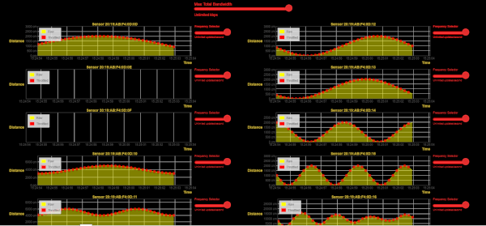

# MQTT.Cool - MQTT Throttling Demo - HTML Client

The **MQTT Throttling Demo** is a simple real-time telemetry application based
on MQTT.Cool and [MIMIC MQTT Simulator](https://www.gambitcomm.com/site/mqttsimulator.php).

## Live Demo

[](https://demos.mqtt.cool/mqtt-throttling/index.html)


## Details

The **MQTT Throttling Demo** is a demonstration of MQTT Cool data throttling 
using simulated sensors by [MIMIC MQTT Simulator](https://www.gambitcomm.com/site/mqttsimulator.php).

## Install

If you want to install a version of this demo pointing to your local MQTT.Cool,
follows these steps.

* Configure an MQTT.Cool instance. Please refer to mqtt.cool web site
[download page](https://mqtt.cool/download/latest-server) to find the MQTT.Cool
download package. MQTT.Cool comes with a set of predefined configurations for
connecting with local MQTT server instances, as well as with the most common
publicly accessible brokers. If you want to provide a new custom configuration,
open the `mqtt_master_connector_conf.xml` file located under
`<MQTT.COOL_HOME>/mqtt_connectors` and provide a set of entries similar to the
following (please refer to the inline documentation for more in-depth
information on how to configure broker connection parameters):

  ```xml
  ...
  <!-- MQTT broker connection parameters for a local instance
       listening on port 1883, aliased by "mybroker". -->
  <param name="mybroker.server_address">tcp://localhost:1883</param>
  <param name="mybroker.connection_timeout">5</param>
  <param name="mybroker.keep_alive">20</param>
  ...
  ```

* Launch the MQTT.Cool server.
* Download this project.
* As the latest version of the MQTT.Cool JavaScript library is always available
through [`unpkg`](https://unpkg.com/#/), it is hot-linked in the html page.
* Deploy this demo on MQTT.Cool (used as Web server) or in any external Web
server. If you choose the former, create a folder with name such as
`mqtt-throttling` under the `<MQTT.COOL_HOME>/pages` folder, and copy there the
contents of `src/web` of this project.

## Configure

The demo assumes that the MQTT.Cool server is launched from localhost, but if
you need to target a different server, search in `src/web/js/app.js` this
line:

```js
const MQTT_COOL_URL = 'http://localhost:8080';
```

and change it accordingly.

## Launch

Open your browser and point it to
[http://localhost:8080/mqtt-throttling](http://localhost:8080/mqtt-throttling),
or to the address according to the host and/or the name of the folder where you
deployed the project.

Immediately, the gauges in the web page reflect updates according to the
received real-time metrics.

## See Also

* [Check out all other demos on MQTT.Cool site](https://mqtt.cool/demos)

## MQTT.Cool Compatibility Notes

* Compatible with MQTT.Cool SDK for Web Clients version 1.2.1 or newer.
* Compatible with MQTT.Cool since version 1.2.0 or newer.
